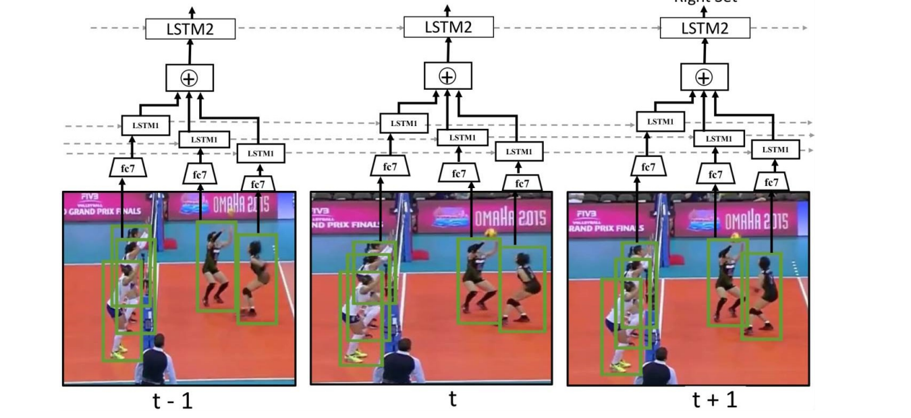

# Deep Activity Recognition

A PyTorch implementation of *"A Hierarchical Deep Temporal Model for Group Activity Recognition"* (Ibrahim et al., CVPR 2016) on the Volleyball Dataset.

This project implements a hierarchy of baselines that progressively build from a simple image classifier to a full two-stage hierarchical model with team-level pooling and temporal LSTMs.

<!-- Replace with a figure from the paper showing the model architecture -->


---

## Results

| Baseline | Method | Paper (AlexNet) | Ours (ResNet-50) |
|----------|--------|:---------------:|:----------------:|
| B1 | Image Classification | 66.7% | **73.73%** |
| B3 | Fine-tuned Person Classification | 68.1% | **81.60%** |
| B4 | Temporal Model (Image Features) | 63.1% | **76.29%** |
| B6 | Two-stage Model without LSTM 1 | 74.7% | **80.03%** |
| B7 | Two-stage Model without LSTM 2 | 80.2% | **86.54%** |
| B8 | Two-stage Hierarchical Model | 81.9% | **88.86%** |

> **Note:** The original paper uses AlexNet as the backbone. My implementation uses ResNet-50, which provides stronger visual features and contributes to the improved accuracy across all baselines.

---

## Architecture Overview

| Baseline | Architecture |
|----------|-------------|
| **B1** | ResNet-50 on full frame → classify group activity |
| **B3** | Stage 1: ResNet-50 on player crops (action recognition) → Stage 2: pool + FC classifier |
| **B4** | LSTM over frame-level ResNet features |
| **B6** | Pool players per frame → scene LSTM → classify |
| **B7** | Player LSTM → max pool over players → scene LSTM → classify |
| **B8** | Player LSTM → team-based max pool → concat teams → scene LSTM → classify |

---

## Quick Start

### Prerequisites

- Python 3.10+
- PyTorch 2.0+
- CUDA GPU (recommended)

### Training Order

Models must be trained in dependency order:

```bash
# 1. Train backbone models (independent)
python -m modeling.b1.train
python -m modeling.b3.train --stage 1

# 2. Extract features (one-time)
python scripts/extract_features.py --mode frame  --checkpoint checkpoints/b1/best_model.pth
python scripts/extract_features.py --mode player --checkpoint checkpoints/b3/best_model_b3_stg1.pth

# 3. Train feature-based models (fast, minutes each)
python -m modeling.b3.train --stage 2
python -m modeling.b4.train
python -m modeling.b6.train
python -m modeling.b7.train
python -m modeling.b8.train
```

---

## Demo

[https://github.com/user-attachments/assets/REPLACE_WITH_YOUR_VIDEO_ID](https://drive.google.com/file/d/1A96RTRV9LJNLhOdsyhk48Ezjy4mUzBfd/view?usp=sharing)

The demo runs the B8 model on a volleyball clip, overlaying:
- **Player bounding boxes** with individual action labels (blocking, spiking, etc.)
- **Group activity prediction** with confidence score, updated on each sliding window

### Run it yourself

```bash
python scripts/demo_inference.py \
    --video_id 4 --clip_id 29211 \
    --backbone_ckpt checkpoints/b3/best_model_b3_stg1.pth \
    --model_ckpt checkpoints/b8/best_model_b8.pth \
    --output demo.mp4 --fps 10
```

---

## Feature Extraction

Two extraction modes are available in `scripts/extract_features.py`:

| Mode | Output Shape | Backbone | Used By |
|------|:------------:|----------|---------|
| `player` | `(9, 12, 2048)` | B3 Stage 1 | B3 stg2, B6, B7, B8 |
| `frame` | `(9, 2048)` | B1 | B4 |

---

## Project Structure

```
Deep-Activity-Recognition/
├── modeling/
│   ├── b1/              # Image classification
│   ├── b3/              # Fine-tuned person classification (two-stage)
│   ├── b4/              # Temporal scene model
│   ├── b6/              # Pool → scene LSTM
│   ├── b7/              # Player LSTM → pool → scene LSTM
│   └── b8/              # Player LSTM → team pool → scene LSTM
├── scripts/
│   └── extract_features.py
├── data_utils/
│   ├── dataset.py       # Volleyball dataset classes
│   └── dataloader.py    # DataLoader factory
├── training/
│   ├── engine.py        # Shared training loop
│   └── reproducibility.py
├── helper_utils/
│   └── evaluation.py    # Test evaluation and confusion matrices
├── features/            # Pre-extracted features (generated)
└── checkpoints/         # Saved model weights (generated)
```

Each baseline directory contains three files: `model.py`, `config.py`, and `train.py`.

---

## Configuration

Override dataset paths via environment variables:

```bash
export VOLLEYBALL_VIDEOS_DIR="/path/to/videos"
export VOLLEYBALL_TRACKS_DIR="/path/to/tracking_annotations"
```

Or edit the defaults in each baseline's `config.py`.

---

## Evaluation

Evaluation runs automatically after training. The engine reloads the best checkpoint, prints a full classification report, and saves a confusion matrix to `checkpoints/`.

---

## Reproducibility

Every training run automatically:
- Sets seeds for `torch`, `numpy`, `random`, and CUDA
- Logs training curves to TensorBoard (`runs/`)
- Saves run metadata (config, git SHA, timestamp) to `checkpoints/`

---

## References

```bibtex
@inproceedings{ibrahim2016hierarchical,
  title={A Hierarchical Deep Temporal Model for Group Activity Recognition},
  author={Ibrahim, Mostafa S and Muralidharan, Srikanth and Deng, Zhiwei and Vahdat, Arash and Mori, Greg},
  booktitle={Proceedings of the IEEE Conference on Computer Vision and Pattern Recognition (CVPR)},
  year={2016}
}
```

---

## License

This project is for educational and research purposes.
